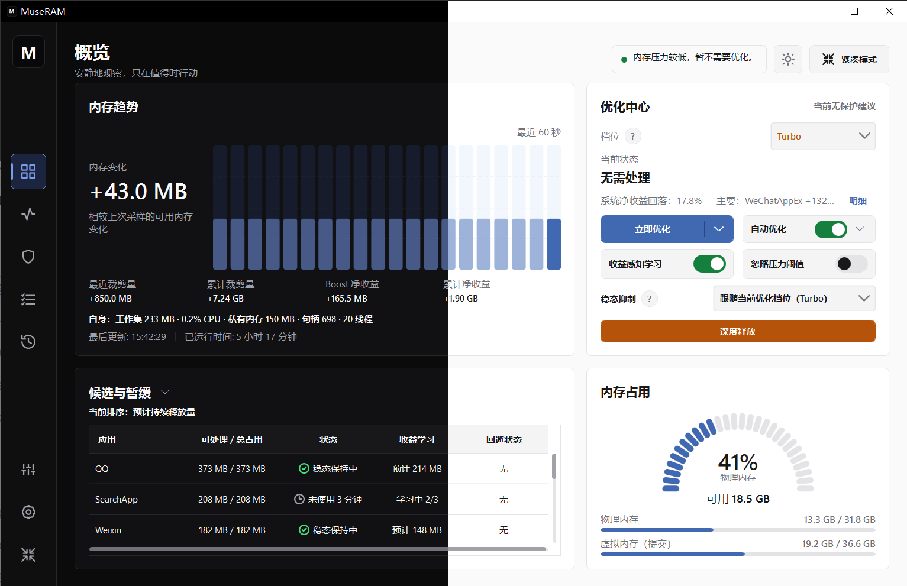
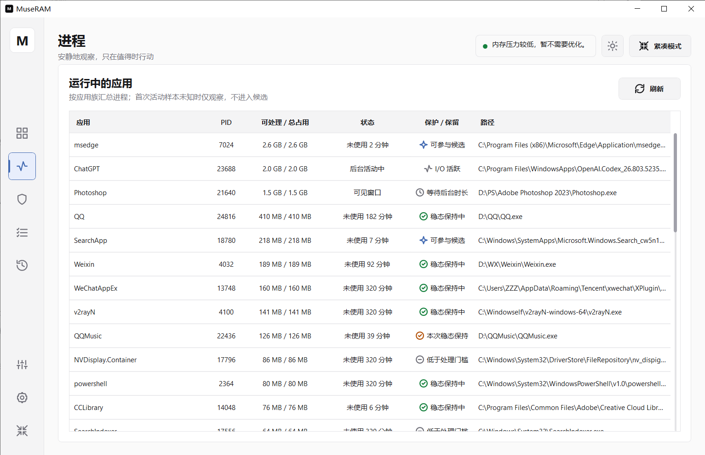
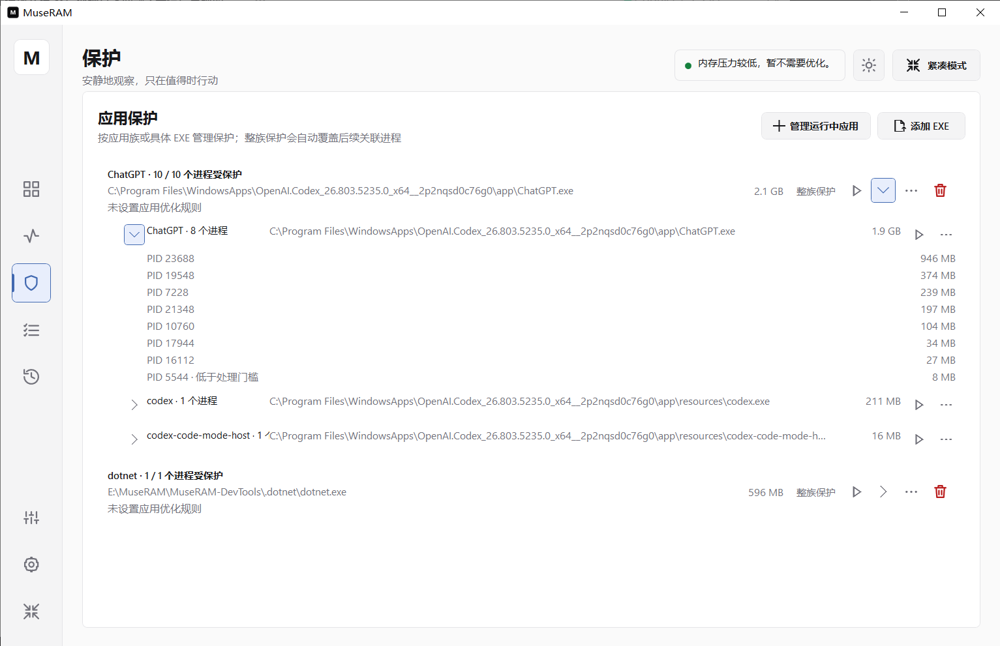
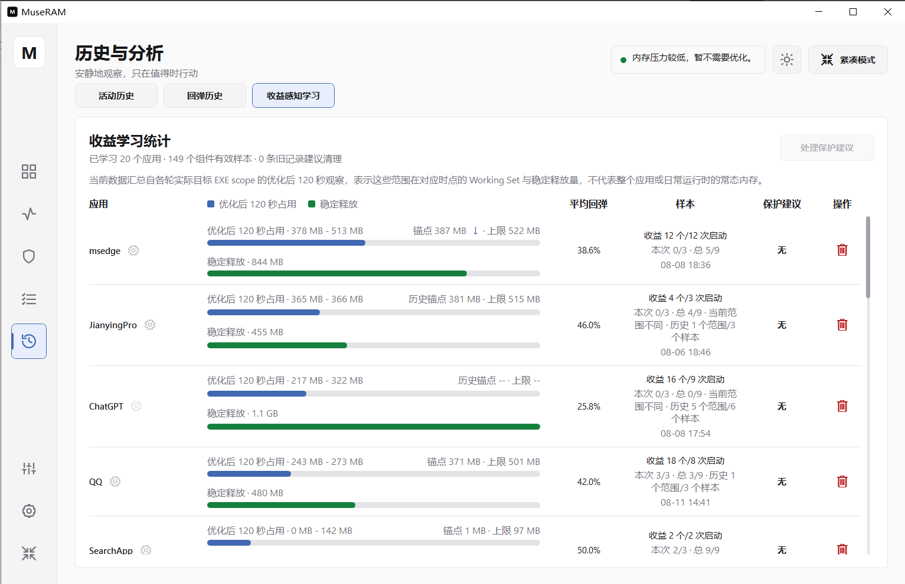
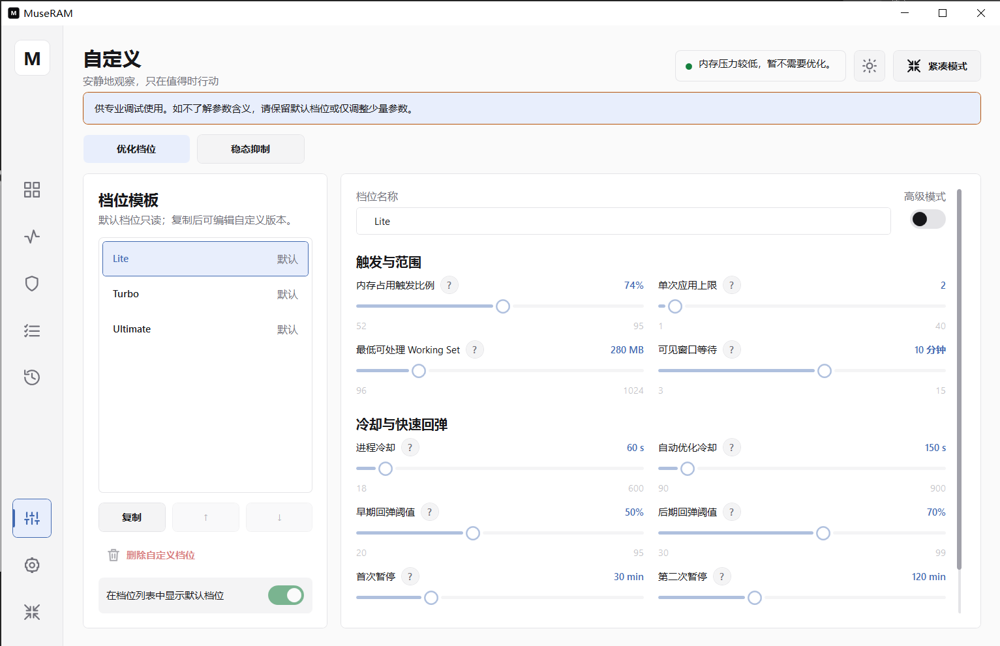

# MuseRAM

[简体中文](./README.md) | [English](./README.en.md)

MuseRAM 是一款面向 Windows 的内存管理工具。它会安静地观察系统状态，帮助你识别适合处理的后台应用，并在尽量不打扰当前工作的前提下进行内存优化。

> 当前版本：`0.1.7.6` · 测试版

## 主要功能

- **清晰了解内存状态**：集中查看内存占用、变化趋势、近期优化结果和程序自身开销。
- **手动或自动优化**：可以随时立即优化，也可以让 MuseRAM 根据当前状态自动处理。
- **全域回收**：快速回收未保护后台进程的内存占用，适合需要在短时间释放更多内存的场景。
- **透明的候选判断**：直接查看哪些应用可参与优化，以及暂缓处理的原因。
- **应用保护**：支持保护整个应用，也可以只保护其中的特定程序。
- **收益学习**：记录不同应用的历史优化表现，让后续判断更贴合实际使用情况。
- **多种使用档位**：提供 Lite、Turbo 和 Ultimate，并支持按需要调整自定义档位。
- **明暗主题与中英文界面**：可跟随 Windows 主题，也可以手动切换。

## 界面预览

### 运行进程

查看正在运行的应用、当前状态以及保护或保留情况。

### 应用保护

按整个应用或具体程序设置保护，展开后可以查看相关进程。

### 收益学习

查看不同应用的历史优化表现、稳定释放情况和样本进度。

### 自定义档位

在默认档位之外调整优化范围、等待时间和其他偏好。

## 下载与使用

1. 前往 [GitHub Releases](https://github.com/Zeilyintro/MuseRAM/releases)，下载便携版 `MuseRAM.zip`，或直接下载单文件版 `MuseRAM.exe`。
2. 便携版解压后即可运行；建议将程序放在一个固定目录中。
3. 按系统提示授予管理员权限。
4. 初次使用建议保留默认设置，并将工作、创作或游戏中的重要应用加入保护。

运行要求：

- Windows 10 或 Windows 11，64 位版本
- .NET 8 Desktop Runtime，64 位版本
- 执行内存优化时需要管理员权限

## 使用提醒

常规内存优化不会关闭应用，但应用再次使用相关内容时，可能发生重新载入或短暂响应变化。对于正在编辑文档、处理创作内容或运行重要任务的应用，建议先加入保护。

“深度释放”与常规优化不同，它用于处理你已经确认不再需要的后台应用。执行前请检查是否存在未保存的内容。

“全域回收”会绕过部分常规限制以快速释放更多后台内存，不会关闭应用；但应用后续使用时更可能发生内存回弹或重新加载。重要应用请先加入保护。

## 本地数据与隐私

MuseRAM 的设置、保护规则、历史记录和学习数据保存在本地。诊断数据默认不会收集；即使手动开启，也只写入本地文件，不会自动上传。

## 当前状态

MuseRAM 目前仍处于测试阶段，界面、默认设置和部分行为可能继续调整。建议优先使用默认档位，并通过 [GitHub Issues](https://github.com/Zeilyintro/MuseRAM/issues) 反馈可复现的问题。

提交问题时，请尽量附上 MuseRAM 版本、Windows 版本、问题发生前的操作步骤和必要截图。公开截图或日志前，请先移除用户名、文件路径及其他私人信息。
